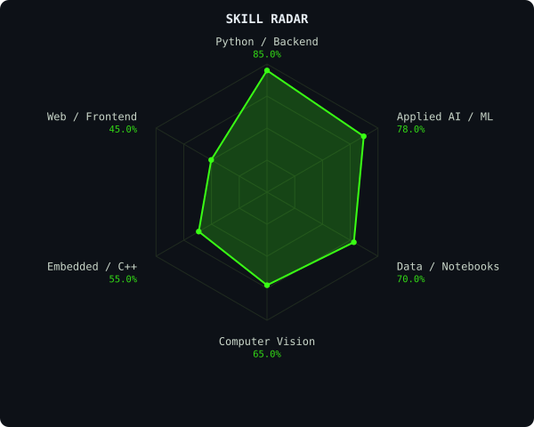
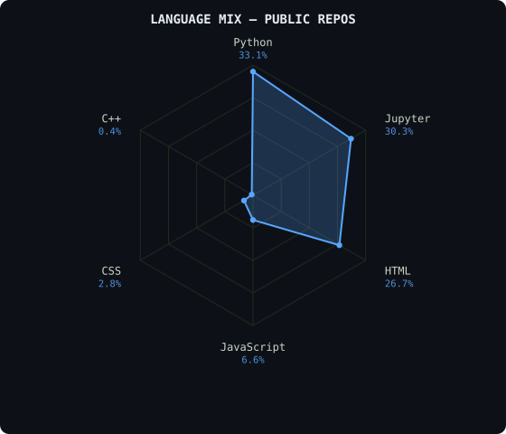
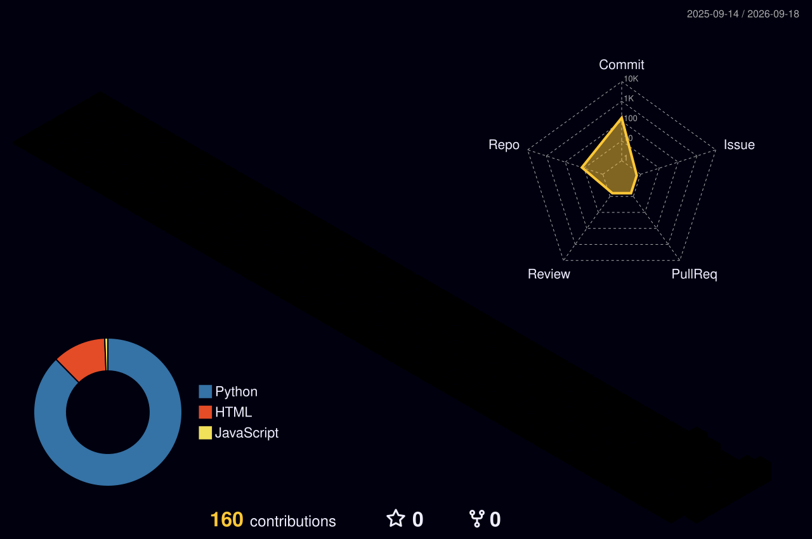

<div align="center">


[](mailto:svanshhika04@gmail.com)
<!-- Add LinkedIn / portfolio / X badges here once you have the links, e.g.:
[](https://www.linkedin.com/in/YOUR-HANDLE/)
[](https://your-site.example)
[](https://x.com/your_handle)
-->


</div>

---

### ~/ whoami

```bash
$ cat about.txt

Hi, I'm Vanshhikaa — an AI/ML developer working on computer vision and
applied AI projects.

  > Built a real-time face recognition & tracking system for CCTV theft detection
  > Contributor to NeuroSystem — EEG-based target acquisition
  > Contributor to BashIn — an offline personal AI assistant
  > Built Weather Predictor — a notebook-based weather forecasting model
  > Shipping hackathon builds (hhgoa-2026-task1)
```

---

### ~/ toolbox

<div align="center">


</div>

---

### ~/ skill radar

<div align="center">
<table><tr>
<td></td>
<td></td>
</tr></table>

<sub>Skill radar is a starting-point self-assessment derived from your public repos — edit the percentages in <code>assets/skill-radar.svg</code> (or regenerate) to match reality. Language mix is computed from live public-repo byte counts.</sub>
</div>

---

### ~/ contribution calendar

<div align="center">



</div>

---

<div align="center">
<sub>Building in the open.</sub>
</div>
